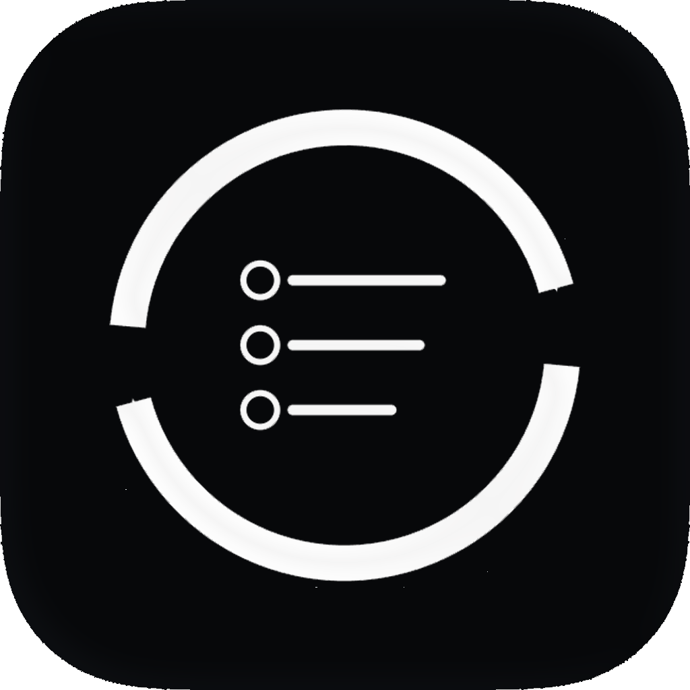

# RepReminders

<p align="center">
   
</p>

RepReminders est une app de rappels répétitifs pensée pour **iPhone + Apple Watch**.
Elle permet de planifier un rappel qui renvoie des notifications à intervalle régulier jusqu'à ce que tu le termines.

Le projet est maintenant volontairement **sans version Mac**.

## Ce que fait l’app

- crée des rappels répétitifs avec titre, date de départ, intervalle et nombre de répétitions
- affiche les rappels actifs et terminés sur iPhone
- affiche les rappels actifs sur Apple Watch
- permet de terminer un rappel depuis l’iPhone, la Watch ou les actions système
- synchronise automatiquement iPhone et Watch
- expose des actions App Raccourcis pour automatiser la création, la suppression et la validation

## Prérequis

- macOS avec Xcode installé
- iPhone et Apple Watch appairés pour tester la synchronisation
- un compte Apple Developer si tu veux installer sur appareil réel avec signature automatique

## Installation

1. Ouvre le projet `RepReminders.xcodeproj`
2. Sélectionne comme destination ton iPhone
3. Vérifie la signature automatique sur les cibles iPhone et Watch
4. Lance le build depuis Xcode

La Watch s’installe via l’app iPhone embarquée.

## Utilisation

### Depuis l’app iPhone

- appuie sur `+` pour créer un rappel
- modifie ou supprime un rappel depuis la liste
- utilise le mode sélection pour terminer, remettre en cours ou supprimer plusieurs rappels

### Depuis l’Apple Watch

- consulte les rappels actifs
- termine un rappel directement depuis la Watch
- la Watch se resynchronise automatiquement avec l’iPhone

### Depuis Raccourcis Apple

Les actions disponibles sont :

- `Créer un rappel`
- `Supprimer un rappel`
- `Valider un rappel`
- `Obtenir rappels`
- `Synchroniser la Watch`
- `Réinitialiser toutes les données`

## Exemple d’automatisation

Exemple pour créer un rappel de présence depuis une automatisation Apple :

```text
[Obtenir les événements du calendrier]
[Choisir dans la liste]
[Obtenir les détails] -> Date de début
[Créer un rappel]
   Titre = "Valider ma présence - [Nom du cours]"
   Intervalle = 5
   Nombre max de répétitions = 20
```

Exemple pour terminer un rappel depuis un raccourci :

```text
[Valider un rappel]
   Titre = "Valider ma présence - [Nom du cours]"
```

## Comportement des notifications

- les notifications sont planifiées localement sur l’appareil
- chaque rappel génère un nombre fini de notifications, défini par `maxRepetitions`
- le bouton de notification ouvre l’app
- la suppression ou la validation nettoie les notifications restantes

## Synchronisation

- l’iPhone envoie un état complet à la Watch après chaque création, suppression ou validation via Raccourcis
- la Watch renvoie aussi ses actions vers l’iPhone
- si la Watch n’est pas installée, la synchro iPhone vers Watch est ignorée proprement

## Structure du projet

```text
RepReminders/       -> app iPhone, modèle de données, notifications et App Intents
RepRemindersWatch/  -> app Apple Watch et synchronisation WatchConnectivity
```
